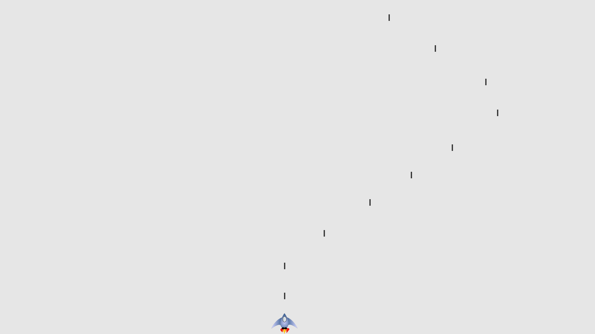

# Introduction

A Simple 2D Alien invation Game made with the pygame module , 
A plane shooting on some aliens , when they colide with you or reach on the bottom 3 times you die 

Project Preview 
----------------
>How the Game Looks Like

## Setup/installation
$ Must have the pygame module installed and that's pretty much it! 
$ Clone the repo: https://github.com/danielerat/pythonAlienInvasionGame.git 
$ cd in the pythonAlienInvasionGame folder
$ Run the file alien_invasion.py and Enjoy.

## Author
Username: danielerat 
Names: Ilunga Gisa Daniel 
email:danielilunga35@gmail.com

## License
MIT

